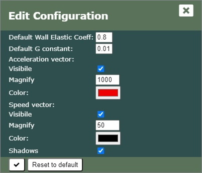
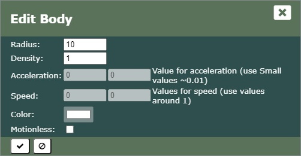

# PhysLabJs

PhysLabJS is a small HTML/CSS/JavaScript application to create one or more small systems made of spheres interacting in a 2D plane. The interaction choosen is a simularione (very simplified) of a bidimesional attractive force.

It is made for fun only, it is not intende to be used for educational purposes.

Made with [Konva.js](https://konvajs.org/).

This is an example a small sistema made with 2 bodies:

## The Application

This is how the application start:

## The Toolbar

The toolbar contains the main set of tool to manage the systems.

The button functions are as follows:

| Button | Function |
|------------|---------------------------------|
| Configuration | Set the main parameters of the application |
| Refresh | Restore original position of the bodies |
| Add | Add a new body tothe system |
| Load | Load the systems from the _local storage_ |
| Save | Save the systems in the _local storage_ |
| Start | Start the interaction |
| Stop | Stop the interaxtion |

## Button Add

| Field | Description |
|-|-|
|Radius|Set the radius of the spherical body. Affect appearance and mass for the gravitational interacation|
|Density|Set the density of the spherical body|
|Acceleration||
|Speed||
|Color||
|Motionless||

## Button Configuration

| Field | Description |
|-|-|
|Radius|Set the radous of the spherical body. Affect appearance and mass for the gravitational interacation|

## Button Edit

| Field | Description |
|-|-|
|Radius|Set the radous of the spherical body. Affect appearance and mass for the gravitational interacation|

## Button System Configuration

| Field | Description |
|-|-|
|Radius|Set the radous of the spherical body. Affect appearance and mass for the gravitational interacation|
